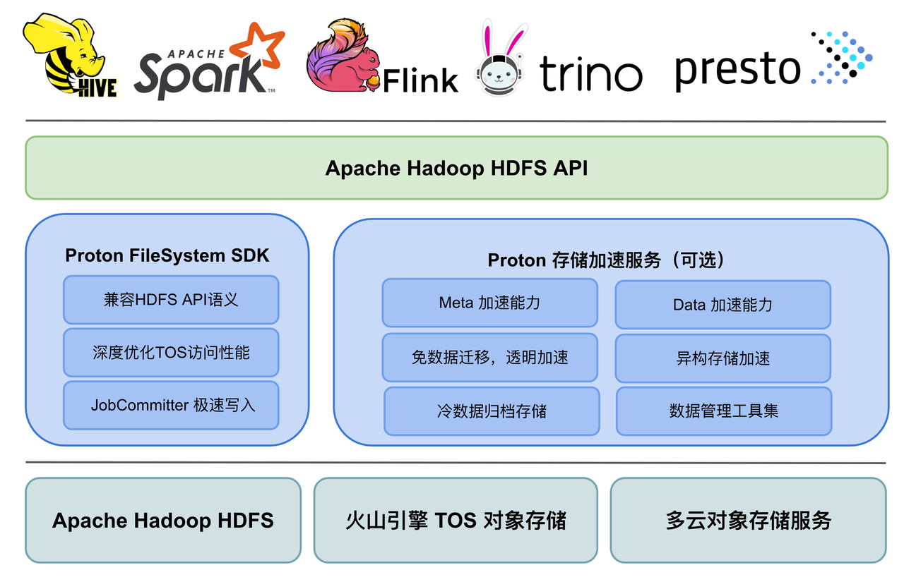

## 介绍
Proton 是火山引擎 EMR 团队推出的针对存算分离场景提供的加速引擎，其深度优化的TOS访问能力和JobCommitter功能，可极大地提升作业的执行效率。


## 代码工程介绍
- flink-on-tos 采用Flink引擎读写TOS的样例代码。
  - com.bytedance.emr.KafkaToTosDemo 读取Kafka的数据写入TOS中

## 使用指导
1. 根据使用的火山EMR版本，修改pom.xml文件中相应组件的版本信息
2. 代码编译
```
mvm package
```

### 执行flink-on-tos样例
#### 1. 执行com.bytedance.emr.KafkaToTosDemo任务，将Kafka的数据写入TOS中 
**步骤一：生成数据** 
将下面的python脚本放在在Kafka集群的client端，并将python脚本命名为：`generate_dummy_data.py`
```
# generate_dummy_data.py
import datetime
import json
import random

def get_data():
    return {
        'event_time': datetime.datetime.now().isoformat(),
        'ticker': random.choice(['AAPL', 'AMZN', 'MSFT', 'INTC', 'TBV']),
        'price': round(random.random() * 100, 2)
    }

if __name__ == '__main__':
    num = 1000
    with open("/root/kafka/dummy_data.json", "a") as f:
        for _ in range(0, num):
            f.write(json.dumps(get_data()) + '\n')
```

根据实际情况，修改下面的命令，并执行，
```
mkdir /root/kafka/
python generate_dummy_data.py

./bin/kafka-topics.sh --bootstrap-server {borker1_ip}:9092,{borker2_ip}:9092 --topic {topic_name} --create

./bin/kafka-console-producer.sh --bootstrap-server {borker1_ip}:9092,{borker2_ip}:9092 --topic {topic_name} < /root/kafka/dummy_data.json
```

**步骤二：提交任务**
根据实际情况，修改下面的命令，填写正确的kafka地址和bucket信息，并执行该命令。这时可以通过YARN页面查看任务的执行情况
```
/usr/lib/emr/current/flink/bin/flink run-application \
-t yarn-application  proton-examples/flink-on-tos/target/flink-on-tos-1.0-SNAPSHOT.jar  \
--tos.output.path tos://{bucket}/xxxx/flink/sdk/ticket_stat_snappy \
--kafka.topic xxx_test \
--kafka.bootstrap.servers {borker1_ip}:9092,{borker2_ip}:9092 \
--checkpoint.path tos://{bucket}/xxxx/flink/ckp/ticket_snappy/
```